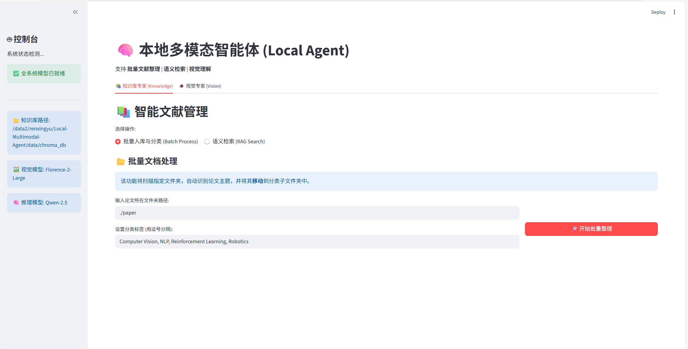
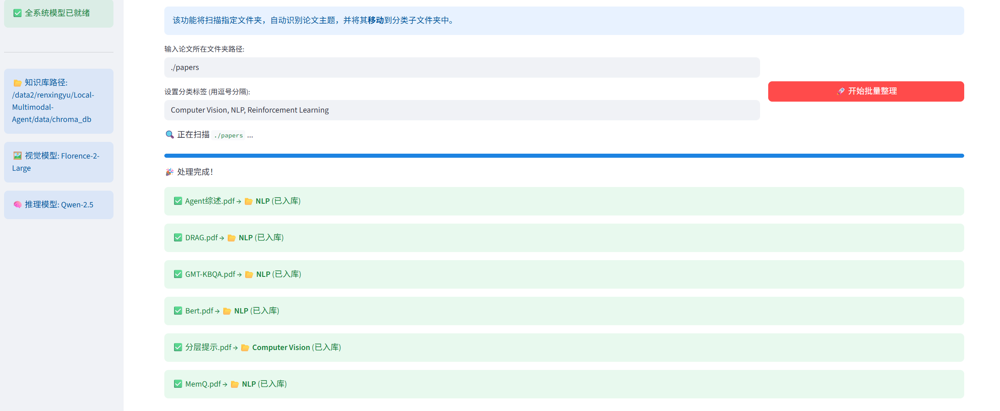
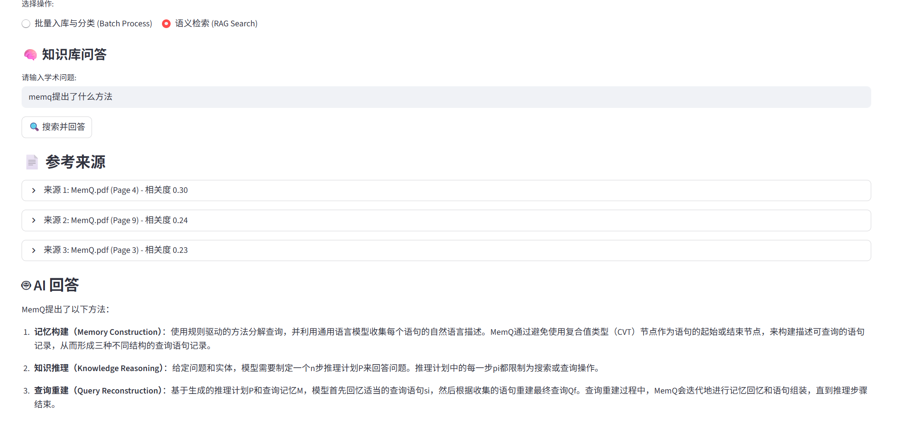
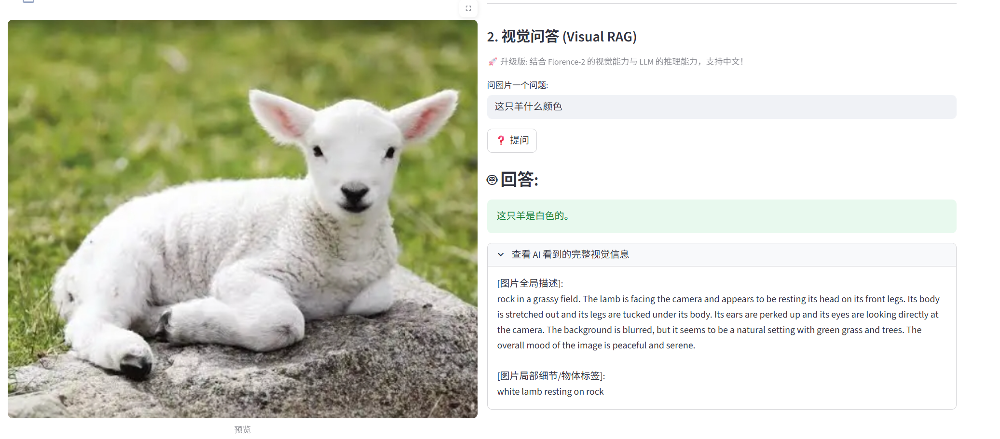
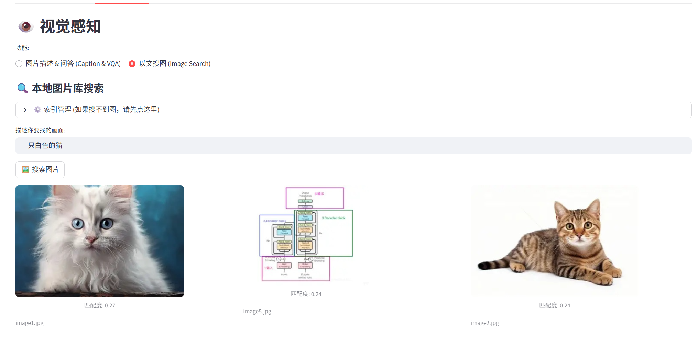

------

# 🧠 Local Multimodal Agent (本地多模态智能体)

## 📖 1. 项目概述 (Project Overview)

**Local Multimodal Agent** 是一个针对个人知识库管理开发的轻量级、隐私优先的本地智能助手。本项目旨在解决传统文件管理系统中“文件名搜索”的局限性，通过集成前沿的多模态神经网络技术，实现了对非结构化数据（PDF文献、图像）的深层语义理解。

系统采用模块化架构，核心包含**智能文献管理 (RAG)** 与 **视觉理解增强 (Visual RAG)** 两大模块。用户可以通过统一的命令行接口 (CLI) 或交互式 Web 面板 (Streamlit) 高效地管理本地资源，实现“所想即所得”的检索体验。

### ✨ 核心功能亮点

- **📚 自动化文献工程 (Automated RAG Pipeline)**
  - **自动归档**: 智能读取 PDF 首页内容，基于 LLM 语义分析将其自动分类并物理移动至对应主题文件夹（如 `CV/`, `NLP/`）。
  - **语义检索**: 构建高维向量索引，支持基于自然语言的学术问答（例如：“Transformer 的自注意力机制是如何工作的？”）。
- **👁️ 视觉链式推理 (Visual Chain-of-Thought)**
  - **Visual RAG**: 创新性地结合 **Florence-2** 的 Dense Captioning 能力与 **Qwen-2.5** 的逻辑推理能力。系统先将图像“翻译”为详尽的文本描述，再由 LLM 进行推理，从而支持复杂的**中文视觉问答**（例如：“这只羊周围的环境是什么样的？”）。
- **🔍 跨模态语义检索 (Cross-Modal Search)**
  - 利用 **CLIP** 模型对图像和文本进行对齐，支持“以文搜图”。用户可通过描述画面内容（如“夕阳下的海边”）毫秒级定位本地图片。
- **🚀 双模态交互接口**
  - 提供面向开发者的 CLI 工具和面向演示的 Streamlit Web UI。

------

## 🏗️ 2. 系统架构与技术栈 (Architecture & Tech Stack)

本项目采用分层架构设计，确保各模态处理模块的解耦与高效协作。

### 2.1 核心组件选型

| **模块**     | **模型/工具**                      | **选型理由**                                                 |
| ------------ | ---------------------------------- | ------------------------------------------------------------ |
| **视觉感知** | **Microsoft Florence-2-Large**     | 目前轻量级模型中 SOTA 级别的视觉理解能力，支持 OD、Caption、Grounding 多种任务。 |
| **图文匹配** | **OpenAI CLIP (ViT-Base-Patch32)** | 经典的双塔结构，提供稳健的图像-文本特征对齐能力，用于以文搜图。 |
| **文本嵌入** | **All-MiniLM-L6-v2**               | 速度快、显存占用极低，适合本地部署的 Sentence Transformer。  |
| **逻辑推理** | **Qwen-2.5-Instruct** (API/Local)  | 拥有强大的中文理解与逻辑推理能力，作为 Agent 的“大脑”处理决策与总结。 |
| **向量存储** | **ChromaDB**                       | 开源嵌入式向量数据库，无需服务器配置，开箱即用。             |
| **交互前端** | **Streamlit**                      | 快速构建数据科学应用的 Python 框架，便于演示多模态交互效果。 |

------

## 💻 3. 环境搭建 (Installation Guide)

### 3.1 基础环境配置

本项目依赖 Python 3.10 及 PyTorch 环境。推荐使用 Conda 进行隔离管理。

Bash

```
# 1. 创建虚拟环境
conda create -n local_agent python=3.10
conda activate local_agent

# 2. 安装 PyTorch (CUDA 11.8 版本示例，请根据实际硬件调整)
pip install torch torchvision torchaudio --index-url https://download.pytorch.org/whl/cu118
```

### 3.2 依赖安装

请确保项目根目录下存在 `requirements.txt`。

Bash

```
pip install -r requirements.txt
```

### 3.3 API 配置 (重要)

本项目使用兼容 OpenAI 格式的 LLM API (Qwen)。请在项目根目录下创建 `.env` 文件并填入您的 Key：

Bash

```
# .env 文件内容
SILICON_FLOW_API_KEY=sk-xxxxxxxxxxxxxxxxxxxx
```

### 3.4 模型自动下载

首次运行系统时，程序会自动通过 `modelscope` 镜像源下载所需模型（Florence-2, CLIP, MiniLM）至本地 `./models` 目录。

- **注意**: 首次下载需预留约 5GB 磁盘空间，并保持网络通畅。

------

## 🚀 4. 使用说明 (Usage Guide)

### 🎨 方式一：Web 可视化演示 (推荐)

Streamlit 界面提供了最直观的功能展示，包含拖拽上传、进度条反馈和多模态对话框。

Bash

```
streamlit run app.py
```

- **访问地址**: `http://localhost:8501`
- **功能演示**:

------

### ⌨️ 方式二：命令行接口 (CLI)

`main.py` 提供了符合 Unix 哲学的命令行工具，便于批量处理任务。

#### 1. 批量文献整理 (Auto-Organize)

扫描指定目录，识别论文主题，建立索引并**物理移动**文件到分类文件夹。

Bash

```
# 示例: 整理 raw_downloads 文件夹
python main.py add_paper raw_downloads/ --topics "Computer Vision, NLP, Reinforcement Learning"
```

> **预期输出**:
>
> Plaintext
>
> ```
> 🚀 开始处理 5 个文件...
> 📄 paper1.pdf -> 🏷️ 识别分类: Computer Vision -> 📂 已移动
> 📄 paper2.pdf -> 🏷️ 识别分类: NLP -> 📂 已移动
> ✅ 批量处理完成，已存入 ChromaDB。
> ```

#### 2. 学术问答 (RAG Search)

Bash

```
python main.py search_paper "Transformer 的核心思想是什么？"
```

#### 3. 建立图片索引 (Indexing)

在进行图片搜索前，需先构建向量库。

Bash

```
python main.py scan_images images/
```

#### 4. 以文搜图 (Image Search)

Bash

```
python main.py search_image "一只在草地上睡觉的猫"
```

#### 5. 视觉问答 (Visual QA)

Bash

```
python main.py ask_image images/sheep.jpg "这只羊是什么颜色的？"
```

> **原理**: Image -> Florence-2 (Caption) -> Text Context -> LLM -> Answer

------

## 📂 5. 项目结构 (Project Structure)

Plaintext

```
Local-Multimodal-Agent/
├── main.py              # CLI 入口：统一指令分发
├── app.py               # Web 入口：Streamlit 可视化界面
├── requirements.txt     # 依赖清单
├── models/              # [自动生成] 本地模型权重目录
├── data/
│   └── chroma_db/       # [自动生成] 向量数据库文件
├── papers/              # 文献存储区 (支持自动分类子目录)
├── images/              # 图片素材库
├── src/                 # 核心源码包
    ├── __init__.py
    ├── config.py        # 全局配置 (路径、API Key、环境变量)
    ├── db_manager.py    # 向量数据库管理 (ChromaDB 增删改查)
    ├── vision_expert.py # 视觉专家模块 (封装 Florence-2 & CLIP)
    ├── text_expert.py   # 文本专家模块 (封装 MiniLM)
    ├── llm_client.py    # LLM 客户端 (处理推理与分类决策)
    └── file_handler.py  # 文件操作工具 (PDF 解析、文件移动)
```

------

## 📸 6. 功能演示截图 (Feature Demos)

本项目提供了直观的 Web 可视化界面，以下是核心功能的运行实录。

### 6.1 🖥️ 系统主界面 (System Overview)
Streamlit 面板集成了控制台状态监测与双模态功能导航，系统启动后自动加载本地模型。



> *图 1: Local Multimodal Agent Web 交互主界面，显示模型加载状态与功能选项卡。*

### 6.2 📚 自动化文献整理 (Auto-Organize Pipeline)
**场景**: 输入包含混乱 PDF 的文件夹路径，系统自动识别论文主题（如 CV, NLP），并将其物理移动至新建的分类子文件夹中。




> *图 2: 批量处理日志展示。可以看到系统成功识别了论文分类，并完成了文件的物理移动与向量入库。*

### 6.3 🧠 语义学术问答 (RAG Search)
**场景**: 针对本地知识库进行学术提问（如“Transformer 的核心机制”），系统检索相关文献片段并生成带有来源引用的回答。



> *图 3: 检索增强生成 (RAG) 演示。左侧显示了从 PDF 中召回的参考片段（含页码），下面为 LLM 基于上下文生成的准确回答。*

### 6.4 👁️ 视觉链式推理 (Visual RAG)
**场景**: 上传图片并用中文提问。系统结合 **Florence-2** 的深度描述与 **LLM** 的逻辑推理，准确回答图片的细节问题。



> *图 4: Visual RAG 演示。尽管 Florence-2 原生不支持中文，但通过本项目的多模态链式架构，系统成功回答了关于“羊的颜色”与“环境”的中文问题。*

### 6.5 🔍 以文搜图 (Cross-Modal Search)
**场景**: 使用自然语言描述（如“sleeping cat”）搜索本地图库，无需依赖文件名即可找到目标图片。



> *图 5: 基于 CLIP 的以文搜图。系统根据语义描述精确匹配到了本地图库中的相关图片。*

---

## ⚠️ 常见问题与注意事项 (Troubleshooting)

1. **显存不足 (OOM Error)**
   - **现象**: 加载 Florence-2-Large 时程序崩溃。
   - **解决**: 请在 `config.py` 中将模型路径切换为 `Florence-2-base`，或强制指定 `device="cpu"`（速度会变慢）。
2. **PDF 解析乱码**
   - **原因**: 部分扫描版 PDF 无法提取文本。
   - **解决**: 目前仅支持可选取的文本 PDF，OCR 功能将在后续版本集成。
3. **VQA 回答不准确**
   - **分析**: Florence-2 对中文 Prompt 支持较弱。
   - **机制**: 本项目已通过“Visual RAG”机制修复此问题（即先生成英文描述，再由 LLM 转译回答），请确保 LLM API 连接正常。

------

## 🔮 未来展望 (Future Work)

- **本地 LLM 量化部署**: 集成 `llama.cpp`，彻底摆脱对云端 API 的依赖，实现 100% 离线运行。
- **多模态 OCR**: 引入 `PaddleOCR` 或 `Got-OCR`，增强对扫描版文档的处理能力。
- **音频模态支持**: 接入 `Whisper` 模型，实现会议录音的自动归档与检索。

------

